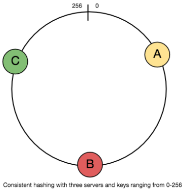
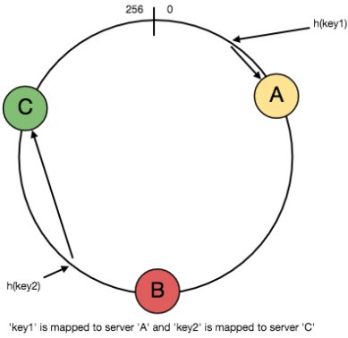
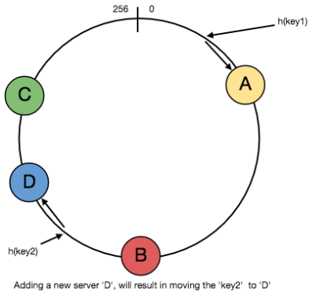
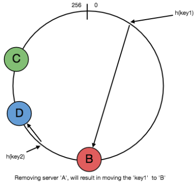
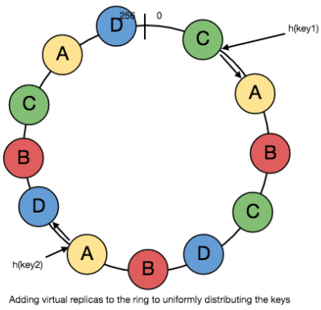

Consistent Hashing
====
Distributed Hash Table (DHT) is one of the fundamental components used in distributed scalable systems. Hash Tables need a key, a value, and a hash function where hash function maps the key to a location where the value is stored.

### 
index = hash_function(key)

Suppose we are designing a distributed caching system. Given ‘n’ cache servers, an intuitive hash function would be ‘key % n’. It is simple and commonly used. But it has two major drawbacks:

1. It is NOT horizontally scalable. Whenever a new cache host is added to the system, all existing mappings are broken. It will be a pain point in maintenance if the caching system contains lots of data. Practically, it becomes difficult to schedule a downtime to update all caching mappings.
2. It may NOT be load balanced, especially for non-uniformly distributed data. In practice, it can be easily assumed that the data will not be distributed uniformly. For the caching system, it translates into some caches becoming hot and saturated while the others idle and are almost empty.

In those situations, consistent hashing is a good way to improve the caching system.

## What is Consistent Hashing?
Consistent hashing is a very useful strategy for distributed caching system and DHTs. It allows us to distribute data across a cluster in such a way that will minimize reorganization when nodes are added or removed. Hence, the caching system will be easier to scale up or scale down.

In Consistent Hashing, when the hash table is resized (e.g. a new cache host is added to the system), only ‘k/n’ keys need to be remapped where ‘k’ is the total number of keys and ‘n’ is the total number of servers. Recall that in a caching system using the ‘mod’ as the hash function, all keys need to be remapped.

In Consistent Hashing, objects are mapped to the same host if possible. When a host is removed from the system, the objects on that host are shared by other hosts; when a new host is added, it takes its share from a few hosts without touching other’s shares.

## How does it work?
As a typical hash function, consistent hashing maps a key to an integer. Suppose the output of the hash function is in the range of [0, 256). Imagine that the integers in the range are placed on a ring such that the values are wrapped around.

Here’s how consistent hashing works:

1. Given a list of cache servers, hash them to integers in the range.
2. To map a key to a server,
    - Hash it to a single integer.
    - Move clockwise on the ring until finding the first cache it encounters.
    - That cache is the one that contains the key. See animation below as an example: key1 maps to cache A; key2 maps to cache C.
    

  
Phase 1

    

  
Phase 2

    

  
Phase 3

    

  
Phase 4

    

  
Phase 5

    

    

To add a new server, say D, keys that were originally residing at C will be split. Some of them will be shifted to D, while other keys will not be touched.

To remove a cache or, if a cache fails, say A, all keys that were originally mapped to A will fall into B, and only those keys need to be moved to B; other keys will not be affected.

For load balancing, as we discussed in the beginning, the real data is essentially randomly distributed and thus may not be uniform. It may make the keys on caches unbalanced.

To handle this issue, we add “virtual replicas” for caches. Instead of mapping each cache to a single point on the ring, we map it to multiple points on the ring, i.e. replicas. This way, each cache is associated with multiple portions of the ring.

If the hash function “mixes well,” as the number of replicas increases, the keys will be more balanced.

# Summary
## Simple hashing
Problems of simple hashing function `key % n` (`n` is the number of servers):
- It is not horizontally scalable. Whenever a new cache host is added to the system, all existing mappings are broken.
- It may not be load balanced, especially for non-uniformly distributed data. Some servers will become hot spots.

## Consistent Hashing
- Consistent hashing maps a key to an integer.
- Imagine that the integers in the range are placed on a ring such that the values are wrapped around.
- Given a list of servers, hash them to integers in the range.
- To map a key to a server:
  - Hash it to a single integer.
  - Move clockwise on the ring until finding the first cache it encounters.
- When the hash table is resized (a server is added or deleted), only `k/n` keys need to be remapped (`k` is the total number of keys, and `n` is the total number of servers).
- To handle hot spots, add “virtual replicas” for caches.
  - Instead of mapping each cache to a single point on the ring, map it to multiple points on the ring (replicas). This way, each cache is associated with multiple portions of the ring.
  - If the hash function is “mixes well,” as the number of replicas increases, the keys will be more balanced.
