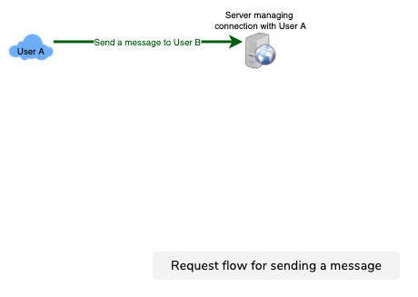
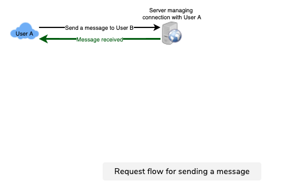
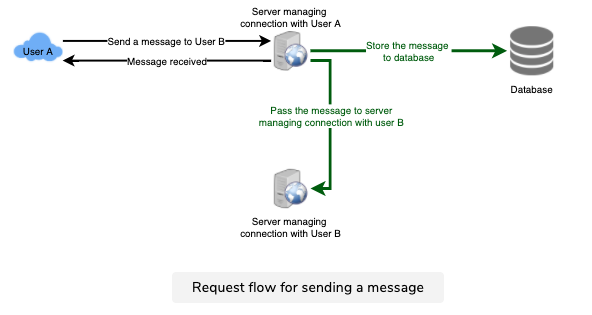
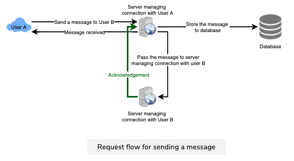
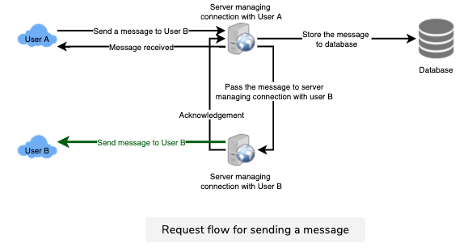
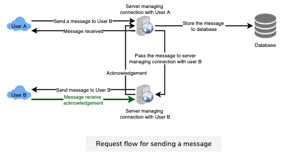
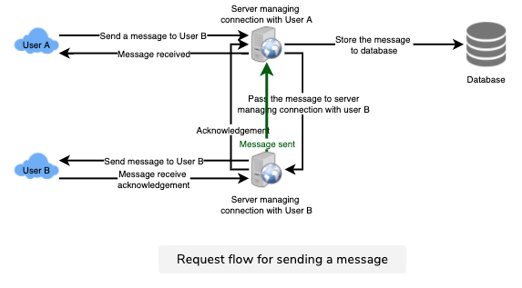
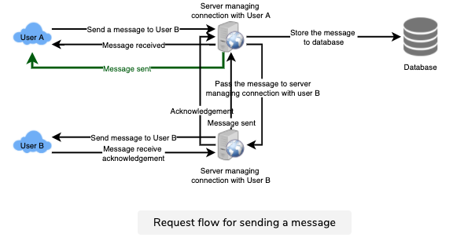

# Facebook Messenger
Let's design an instant messaging service like Facebook Messenger where users can send text messages to each other through web and mobile interfaces.

## 1. What is Facebook Messenger?
Facebook Messenger is a software application which provides text-based instant messaging services to its users. Messenger users can chat with their Facebook friends both from cell-phones and Facebook’s website.

## 2. Requirements and Goals of the System
Our Messenger should meet the following requirements:

### Functional Requirements:
1. Messenger should support one-on-one conversations between users.
2. Messenger should keep track of the online/offline statuses of its users.
3. Messenger should support the persistent storage of chat history.

### Non-functional Requirements:
1. Users should have real-time chat experience with minimum latency.
2. Our system should be highly consistent; users should be able to see the same chat history on all their devices.
3. Messenger’s high availability is desirable; we can tolerate lower availability in the interest of consistency.

### Extended Requirements:
* Group Chats: Messenger should support multiple people talking to each other in a group.
* Push notifications: Messenger should be able to notify users of new messages when they are offline.

## 3. Capacity Estimation and Constraints
Let’s assume that we have 500 million daily active users and on average each user sends 40 messages daily; this gives us 20 billion messages per day.

**Storage Estimation**: Let’s assume that on average a message is 100 bytes, so to store all the messages for one day we would need 2TB of storage.

#### 
20 billion messages * 100 bytes => 2 TB/day

To store five years of chat history, we would need 3.6 petabytes of storage.

#### 
2 TB * 365 days * 5 years ~= 3.6 PB

Other than the chat messages, we would also need to store users’ information, messages’ metadata (ID, Timestamp, etc.). Not to mention, the above calculation doesn’t take data compression and replication into consideration.

**Bandwidth Estimation**: If our service is getting 2TB of data every day, this will give us 25MB of incoming data for each second.

#### 
2 TB / 86400 sec ~= 25 MB/s

Since each incoming message needs to go out to another user, we will need the same amount of bandwidth 25MB/s for both upload and download.

**High level estimates:**

|   |   |
|---|---|
|Total messages | 20 billion per day|
|Storage for each day | 2TB|
|Storage for 5 years | 3.6PB|
|Incomming data | 25MB/s|
|Outgoing data | 25MB/s|

## 4. High Level Design
At a high-level, we will need a chat server that will be the central piece, orchestrating all the communications between users. When a user wants to send a message to another user, they will connect to the chat server and send the message to the server; the server then passes that message to the other user and also stores it in the database.

The detailed workflow would look like this:

1. User-A sends a message to User-B through the chat server.
2. The server receives the message and sends an acknowledgment to User-A.
3. The server stores the message in its database and sends the message to User-B.
4. User-B receives the message and sends the acknowledgment to the server.
5. The server notifies User-A that the message has been delivered successfully to User-B.

  
Phase 1

    

  
Phase 2

    

  
Phase 3

    

  
Phase 4

    

    

  
Phase 5

    

    

  
Phase 6

    

    

  
Phase 7

    

    

  
Phase 8

    

## 5. Detailed Component Design
Let’s try to build a simple solution first where everything runs on one server. At the high level our system needs to handle the following use cases:

1. Receive incoming messages and deliver outgoing messages.
2. Store and retrieve messages from the database.
3. Keep a record of which user is online or has gone offline, and notify all the relevant users about these status changes.

Let’s talk about these scenarios one by one:

### a. Messages Handling
**How would we efficiently send/receive messages?** To send messages, a user needs to connect to the server and post messages for the other users. To get a message from the server, the user has two options:

1. Pull model: Users can periodically ask the server if there are any new messages for them.
2. Push model: Users can keep a connection open with the server and can depend upon the server to notify them whenever there are new messages.

If we go with our first approach, then the server needs to keep track of messages that are still waiting to be delivered, and as soon as the receiving user connects to the server to ask for any new message, the server can return all the pending messages. To minimize latency for the user, they have to check the server quite frequently, and most of the time they will be getting an empty response if there are no pending message. This will waste a lot of resources and does not look like an efficient solution.

If we go with our second approach, where all the active users keep a connection open with the server, then as soon as the server receives a message it can immediately pass the message to the intended user. This way, the server does not need to keep track of the pending messages, and we will have minimum latency, as the messages are delivered instantly on the opened connection.

**How will clients maintain an open connection with the server?** We can use [HTTP Long Polling](../basics/client-server-communication.md) or [WebSockets](../basics/client-server-communication.md). In long polling, clients can request information from the server with the expectation that the server may not respond immediately. If the server has no new data for the client when the poll is received, instead of sending an empty response, the server holds the request open and waits for response information to become available. Once it does have new information, the server immediately sends the response to the client, completing the open request. Upon receipt of the server response, the client can immediately issue another server request for future updates. This gives a lot of improvements in latencies, throughputs, and performance. The long polling request can timeout or can receive a disconnect from the server, in that case, the client has to open a new request.

**How can the server keep track of all the opened connection to redirect messages to the users efficiently?** The server can maintain a hash table, where “key” would be the UserID and “value” would be the connection object. So whenever the server receives a message for a user, it looks up that user in the hash table to find the connection object and sends the message on the open request.

**What will happen when the server receives a message for a user who has gone offline?** If the receiver has disconnected, the server can notify the sender about the delivery failure. If it is a temporary disconnect, e.g., the receiver’s long-poll request just timed out, then we should expect a reconnect from the user. In that case, we can ask the sender to retry sending the message. This retry could be embedded in the client’s logic so that users don’t have to retype the message. The server can also store the message for a while and retry sending it once the receiver reconnects.

**How many chat servers we need?** Let’s plan for 500 million connections at any time. Assuming a modern server can handle 50K concurrent connections at any time, we would need 10K such servers.

**How do we know which server holds the connection to which user?** We can introduce a software load balancer in front of our chat servers; that can map each UserID to a server to redirect the request.

**How should the server process a ‘deliver message’ request?** The server needs to do the following things upon receiving a new message: 

 1. Store the message in the database
 2. Send the message to the receiver and
 3. Send an acknowledgment to the sender.

The chat server will first find the server that holds the connection for the receiver and pass the message to that server to send it to the receiver. The chat server can then send the acknowledgment to the sender; we don’t need to wait for storing the message in the database (this can happen in the background). Storing the message is discussed in the next section.

**How does the messenger maintain the sequencing of the messages?** We can store a timestamp with each message, which is the time the message is received by the server. This will still not ensure correct ordering of messages for clients. The scenario where the server timestamp cannot determine the exact order of messages would look like this:

1. User-1 sends a message M1 to the server for User-2.
2. The server receives M1 at T1.
3. Meanwhile, User-2 sends a message M2 to the server for User-1.
4. The server receives the message M2 at T2, such that T2 > T1.
5. The server sends message M1 to User-2 and M2 to User-1.

So User-1 will see M1 first and then M2, whereas User-2 will see M2 first and then M1.

To resolve this, we need to keep a sequence number with every message for each client. This sequence number will determine the exact ordering of messages for EACH user. With this solution, both clients will see a different view of the message sequence, but this view will be consistent for them on all devices.

### b. Storing and retrieving the messages from the database
Whenever the chat server receives a new message, it needs to store it in the database. To do so, we have two options:

1. Start a separate thread, which will work with the database to store the message.
2. Send an asynchronous request to the database to store the message.

We have to keep certain things in mind while designing our database:

1. How to efficiently work with the database connection pool.
2. How to retry failed requests.
3. Where to log those requests that failed even after some retries.
4. How to retry these logged requests (that failed after the retry) when all the issues have resolved.

**Which storage system we should use?** We need to have a database that can support a very high rate of small updates and also fetch a range of records quickly. This is required because we have a huge number of small messages that need to be inserted in the database and, while querying, a user is mostly interested in sequentially accessing the messages.

We cannot use RDBMS like MySQL or NoSQL like MongoDB because we cannot afford to read/write a row from the database every time a user receives/sends a message. This will not only make the basic operations of our service run with high latency but also create a huge load on databases.

Both of our requirements can be easily met with a wide-column database solution like [HBase](https://en.wikipedia.org/wiki/Apache_HBase). HBase is a column-oriented key-value NoSQL database that can store multiple values against one key into multiple columns. HBase is modeled after Google’s [BigTable](https://en.wikipedia.org/wiki/Bigtable) and runs on top of Hadoop Distributed File System ([HDFS](https://en.wikipedia.org/wiki/Apache_Hadoop)). HBase groups data together to store new data in a memory buffer and, once the buffer is full, it dumps the data to the disk. This way of storage not only helps to store a lot of small data quickly but also fetching rows by the key or scanning ranges of rows. HBase is also an efficient database to store variable sized data, which is also required by our service.

**How should clients efficiently fetch data from the server?** Clients should paginate while fetching data from the server. Page size could be different for different clients, e.g., cell phones have smaller screens, so we need a fewer number of message/conversations in the viewport.

### c. Managing user’s status
We need to keep track of user’s online/offline status and notify all the relevant users whenever a status change happens. Since we are maintaining a connection object on the server for all active users, we can easily figure out the user’s current status from this. With 500M active users at any time, if we have to broadcast each status change to all the relevant active users, it will consume a lot of resources. We can do the following optimization around this:

1. Whenever a client starts the app, it can pull the current status of all users in their friends’ list.
2. Whenever a user sends a message to another user that has gone offline, we can send a failure to the sender and update the status on the client.
3. Whenever a user comes online, the server can always broadcast that status with a delay of a few seconds to see if the user does not go offline immediately.
4. Clients can pull the status from the server about those users that are being shown on the user’s viewport. This should not be a frequent operation, as the server is broadcasting the online status of users and we can live with the stale offline status of users for a while.
5. Whenever the client starts a new chat with another user, we can pull the status at that time.

**Design Summary**: Clients will open a connection to the chat server to send a message; the server will then pass it to the requested user. All the active users will keep a connection open with the server to receive messages. Whenever a new message arrives, the chat server will push it to the receiving user on the long poll request. Messages can be stored in HBase, which supports quick small updates, and range based searches. The servers can broadcast the online status of a user to other relevant users. Clients can pull status updates for users who are visible in the client’s viewport on a less frequent basis.

## 6. Data partitioning
Since we will be storing a lot of data (3.6PB for five years), we need to distribute it onto multiple database servers. What will be our partitioning scheme?

**Partitioning based on UserID**: Let’s assume we partition based on the hash of the UserID so that we can keep all messages of a user on the same database. If one DB shard is 4TB, we will have “3.6PB/4TB ~= 900” shards for five years. For simplicity, let’s assume we keep 1K shards. So we will find the shard number by “hash(UserID) % 1000” and then store/retrieve the data from there. This partitioning scheme will also be very quick to fetch chat history for any user.

In the beginning, we can start with fewer database servers with multiple shards residing on one physical server. Since we can have multiple database instances on a server, we can easily store multiple partitions on a single server. Our hash function needs to understand this logical partitioning scheme so that it can map multiple logical partitions on one physical server.

Since we will store an unlimited history of messages, we can start with a big number of logical partitions, which will be mapped to fewer physical servers, and as our storage demand increases, we can add more physical servers to distribute our logical partitions.

**Partitioning based on MessageID**: If we store different messages of a user on separate database shards, fetching a range of messages of a chat would be very slow, so we should not adopt this scheme.

## 7. Cache
We can cache a few recent messages (say last 15) in a few recent conversations that are visible in a user’s viewport (say last 5). Since we decided to store all of the user’s messages on one shard, the cache for a user should entirely reside on one machine too.

## 8. Load balancing
We will need a load balancer in front of our chat servers; that can map each UserID to a server that holds the connection for the user and then direct the request to that server. Similarly, we would need a load balancer for our cache servers.

## 9. Fault tolerance and Replication
**What will happen when a chat server fails?** Our chat servers are holding connections with the users. If a server goes down, should we devise a mechanism to transfer those connections to some other server? It’s extremely hard to failover TCP connections to other servers; an easier approach can be to have clients automatically reconnect if the connection is lost.

**Should we store multiple copies of user messages?** We cannot have only one copy of the user’s data, because if the server holding the data crashes or is down permanently, we don’t have any mechanism to recover that data. For this, either we have to store multiple copies of the data on different servers or use techniques like Reed-Solomon encoding to distribute and replicate it.

## 10. Extended Requirements
### a. Group chat
We can have separate group-chat objects in our system that can be stored on the chat servers. A group-chat object is identified by GroupChatID and will also maintain a list of people who are part of that chat. Our load balancer can direct each group chat message based on GroupChatID and the server handling that group chat can iterate through all the users of the chat to find the server handling the connection of each user to deliver the message.

In databases, we can store all the group chats in a separate table partitioned based on GroupChatID.

### b. Push notifications
In our current design, users can only send messages to active users and if the receiving user is offline, we send a failure to the sending user. Push notifications will enable our system to send messages to offline users.

For Push notifications, each user can opt-in from their device (or a web browser) to get notifications whenever there is a new message or event. Each manufacturer maintains a set of servers that handles pushing these notifications to the user.

To have push notifications in our system, we would need to set up a Notification server, which will take the messages for offline users and send them to the manufacture’s push notification server, which will then send them to the user’s device.

##
