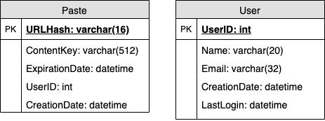
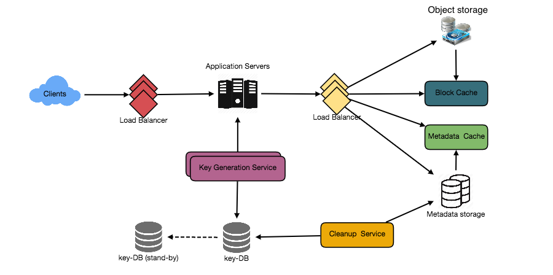

# Pastebin
### Let's design a Pastebin like web service, where users can store plain text. Users of the service will enter a piece of text and get a randomly generated URL to access it.

Similar Services: pastebin.com, pasted.co, chopapp.com

Difficulty Level: Easy

## 1. What is Pastebin?
Pastebin like services enable users to store plain text or images over the network (typically the Internet) and generate unique URLs to access the uploaded data. Such services are also used to share data over the network quickly, as users would just need to pass the URL to let other users see it.

If you haven’t used [pastebin.com](http://pastebin.com/) before, please try creating a new ‘Paste’ there and spend some time going through the different options their service offers. This will help you a lot in understanding this chapter.

## 2. Requirements and Goals of the System
Our Pastebin service should meet the following requirements:

### Functional Requirements:

1. Users should be able to upload or “paste” their data and get a unique URL to access it.
2. Users will only be able to upload text.
3. Data and links will expire after a specific timespan automatically; users should also be able to specify expiration time.
4. Users should optionally be able to pick a custom alias for their paste.

### Non-Functional Requirements:

1. The system should be highly reliable, any data uploaded should not be lost.
2. The system should be highly available. This is required because if our service is down, users will not be able to access their Pastes.
3. Users should be able to access their Pastes in real-time with minimum latency.
4. Paste links should not be guessable (not predictable).

### Extended Requirements:

1. Analytics, e.g., how many times a paste was accessed?
2. Our service should also be accessible through REST APIs by other services.

## 3. Some Design Considerations
Pastebin shares some requirements with [URL Shortening service](./short-url.md), but there are some additional design considerations we should keep in mind.

What should be the limit on the amount of text user can paste at a time? We can limit users not to have Pastes bigger than 10MB to stop the abuse of the service.

Should we impose size limits on custom URLs? Since our service supports custom URLs, users can pick any URL that they like, but providing a custom URL is not mandatory. However, it is reasonable (and often desirable) to impose a size limit on custom URLs, so that we have a consistent URL database.

## 4. Capacity Estimation and Constraints
Our services will be read-heavy; there will be more read requests compared to new Pastes creation. We can assume a 5:1 ratio between read and write.

**Traffic estimates:** Pastebin services are not expected to have traffic similar to Twitter or Facebook, let’s assume here that we get one million new pastes added to our system every day. This leaves us with five million reads per day.

New Pastes per second:

#### 
1M / (24 hours * 3600 seconds) ~= 12 pastes/sec

  
Paste reads per second:

#### 
5M / (24 hours * 3600 seconds) ~= 58 reads/sec

  
**Storage estimates:** Users can upload maximum 10MB of data; commonly Pastebin like services are used to share source code, configs or logs. Such texts are not huge, so let’s assume that each paste on average contains 10KB.

At this rate, we will be storing 10GB of data per day.

#### 
1M * 10KB => 10 GB/day

  
If we want to store this data for ten years we would need the total storage capacity of 36TB.

With 1M pastes every day we will have 3.6 billion Pastes in 10 years. We need to generate and store keys to uniquely identify these pastes. If we use base64 encoding ([A-Z, a-z, 0-9, ., -]) we would need six letters strings:

#### 
64^6 ~= 68.7 billion unique strings

  
If it takes one byte to store one character, total size required to store 3.6B keys would be:

#### 
3.6B * 6 => 22 GB

  
22GB is negligible compared to 36TB. To keep some margin, we will assume a 70% capacity model (meaning we don’t want to use more than 70% of our total storage capacity at any point), which raises our storage needs to 51.4TB.

**Bandwidth estimates:** For write requests, we expect 12 new pastes per second, resulting in 120KB of ingress per second.

#### 
12 * 10KB => 120 KB/s

  
As for the read request, we expect 58 requests per second. Therefore, total data egress (sent to users) will be 0.6 MB/s.

#### 
58 * 10KB => 0.6 MB/s

  
Although total ingress and egress are not big, we should keep these numbers in mind while designing our service.

**Memory estimates:** We can cache some of the hot pastes that are frequently accessed. Following the 80-20 rule, meaning 20% of hot pastes generate 80% of traffic, we would like to cache these 20% pastes

Since we have 5M read requests per day, to cache 20% of these requests, we would need:

#### 
0.2 * 5M * 10KB ~= 10 GB

## 5. System APIs
We can have SOAP or REST APIs to expose the functionality of our service. Following could be the definitions of the APIs to create/retrieve/delete Pastes:

#### 
addPaste(api_dev_key, paste_data, custom_url=None user_name=None, paste_name=None, expire_date=None)

**Parameters:**
* api_dev_key (string): The API developer key of a registered account. This will be used to, among other things, throttle users based on their allocated quota.
* paste_data (string): Textual data of the paste.
* custom_url (string): Optional custom URL.
* user_name (string): Optional user name to be used to generate URL.
* paste_name (string): Optional name of the paste
* expire_date (string): Optional expiration date for the paste.

**Returns:** (string)
A successful insertion returns the URL through which the paste can be accessed, otherwise, it will return an error code.

Similarly, we can have retrieve and delete Paste APIs:

#### 
getPaste(api_dev_key, api_paste_key)

Where “api_paste_key” is a string representing the Paste Key of the paste to be retrieved. This API will return the textual data of the paste.

#### 
deletePaste(api_dev_key, api_paste_key)

A successful deletion returns ‘true’, otherwise returns ‘false’.

## 6. Database Design
A few observations about the nature of the data we are storing:

We need to store billions of records.
Each metadata object we are storing would be small (less than 1KB).
Each paste object we are storing can be of medium size (it can be a few MB).
There are no relationships between records, except if we want to store which user created what Paste.
Our service is read-heavy.
Database Schema:
We would need two tables, one for storing information about the Pastes and the other for users’ data.

Here, ‘URlHash’ is the URL equivalent of the TinyURL and ‘ContentKey’ is a reference to an external object storing the contents of the paste; we’ll discuss the external storage of the paste contents later in the chapter.

## 7. High Level Design
At a high level, we need an application layer that will serve all the read and write requests. Application layer will talk to a storage layer to store and retrieve data. We can segregate our storage layer with one database storing metadata related to each paste, users, etc., while the other storing the paste contents in some object storage (like [Amazon S3](https://en.wikipedia.org/wiki/Amazon_S3)). This division of data will also allow us to scale them individually.

## 8. Component Design
### a. Application layer
Our application layer will process all incoming and outgoing requests. The application servers will be talking to the backend data store components to serve the requests.

**How to handle a write request?** Upon receiving a write request, our application server will generate a six-letter random string, which would serve as the key of the paste (if the user has not provided a custom key). The application server will then store the contents of the paste and the generated key in the database. After the successful insertion, the server can return the key to the user. One possible problem here could be that the insertion fails because of a duplicate key. Since we are generating a random key, there is a possibility that the newly generated key could match an existing one. In that case, we should regenerate a new key and try again. We should keep retrying until we don’t see failure due to the duplicate key. We should return an error to the user if the custom key they have provided is already present in our database.

Another solution of the above problem could be to run a standalone Key Generation Service (KGS) that generates random six letters strings beforehand and stores them in a database (let’s call it key-DB). Whenever we want to store a new paste, we will just take one of the already generated keys and use it. This approach will make things quite simple and fast since we will not be worrying about duplications or collisions. KGS will make sure all the keys inserted in key-DB are unique. KGS can use two tables to store keys, one for keys that are not used yet and one for all the used keys. As soon as KGS gives some keys to an application server, it can move these to the used keys table. KGS can always keep some keys in memory so that whenever a server needs them, it can quickly provide them. As soon as KGS loads some keys in memory, it can move them to the used keys table, this way we can make sure each server gets unique keys. If KGS dies before using all the keys loaded in memory, we will be wasting those keys. We can ignore these keys given that we have a huge number of them.

**Isn’t KGS a single point of failure?** Yes, it is. To solve this, we can have a standby replica of KGS and whenever the primary server dies it can take over to generate and provide keys.

**Can each app server cache some keys from key-DB?** Yes, this can surely speed things up. Although in this case, if the application server dies before consuming all the keys, we will end up losing those keys. This could be acceptable since we have 68B unique six letters keys, which are a lot more than we require.

**How does it handle a paste read request?** Upon receiving a read paste request, the application service layer contacts the datastore. The datastore searches for the key, and if it is found, returns the paste’s contents. Otherwise, an error code is returned.

### b. Datastore layer
We can divide our datastore layer into two:

1. Metadata database: We can use a relational database like MySQL or a Distributed Key-Value store like Dynamo or Cassandra.
2. Object storage: We can store our contents in an Object Storage like Amazon’s S3. Whenever we feel like hitting our full capacity on content storage, we can easily increase it by adding more servers.

## 9. Purging or DB Cleanup
Please see [Designing a URL Shortening service](./short-url.md).

## 10. Data Partitioning and Replication
Please see [Designing a URL Shortening service](./short-url.md).

## 11. Cache and Load Balancer
Please see [Designing a URL Shortening service](./short-url.md).

## 12. Security and Permissions
Please see [Designing a URL Shortening service](./short-url.md).
