# URL Shortening Service

### Designing a URL Shortening service like TinyURL
Let's design a URL shortening service like TinyURL. This service will provide short aliases redirecting to long URLs.

Similar services: bit.ly, goo.gl, qlink.me, etc.

Difficulty Level: Easy

## 1. Why do we need URL shortening?
URL shortening is used to create shorter aliases for long URLs. We call these shortened aliases “short links.” Users are redirected to the original URL when they hit these short links. Short links save a lot of space when displayed, printed, messaged, or tweeted. Additionally, users are less likely to mistype shorter URLs.

For example, if we shorten this page through TinyURL:

```
https://www.google.com/search?q=computer+science&oq=computer+science&aqs=chrome..69i57j0j69i59l2j0j69i61l3.11125j0j4&sourceid=chrome&ie=UTF-8
```

We would get:

```
https://tinyurl.com/y7lpl6np
```

The shortened URL is nearly one-third the size of the actual URL.

URL shortening is used for optimizing links across devices, tracking individual links to analyze audience and campaign performance, and hiding affiliated original URLs.

If you haven’t used [tinyurl.com](http://tinyurl.com/) before, please try creating a new shortened URL and spend some time going through the various options their service offers. This will help you a lot in understanding this chapter.

## 2. Requirements and Goals of the System

### 💡 You should always clarify requirements at the beginning of the interview. Be sure to ask questions to find the exact scope of the system that the interviewer has in mind.
Our URL shortening system should meet the following requirements:

### Functional Requirements:
1. Given a URL, our service should generate a shorter and unique alias of it. This is called a short link. This link should be short enough to be easily copied and pasted into applications.
2. When users access a short link, our service should redirect them to the original link.
3. Users should optionally be able to pick a custom short link for their URL.
4. Links will expire after a standard default timespan. Users should be able to specify the expiration time.

### Non-Functional Requirements:
1. The system should be highly available. This is required because, if our service is down, all the URL redirections will start failing.
2. URL redirection should happen in real-time with minimal latency.
3. Shortened links should not be guessable (not predictable).

### Extended Requirements:
1. Analytics; e.g., how many times a redirection happened?
2. Our service should also be accessible through REST APIs by other services.

## 3. Capacity Estimation and Constraints
Our system will be read-heavy. There will be lots of redirection requests compared to new URL shortenings. Let’s assume a 100:1 ratio between read and write.

**Traffic estimates**: Assuming, we will have 500M new URL shortenings per month, with 100:1 read/write ratio, we can expect 50B redirections during the same period:

#### <div align="center">100 * 500M => 50B</div>

What would be Queries Per Second (QPS) for our system? New URLs shortenings per second:

#### <div align="center">500 million / (30 days * 24 hours * 3600 seconds) = ~200 URLs/s</div>

Considering 100:1 read/write ratio, URLs redirections per second will be:

#### <div align="center">100 * 200 URLs/s = 20K/s</div>

**Storage estimates**: Let’s assume we store every URL shortening request (and associated shortened link) for 5 years. Since we expect to have 500M new URLs every month, the total number of objects we expect to store will be 30 billion:

#### <div align="center">500 million * 5 years * 12 months = 30 billion</div>

Let’s assume that each stored object will be approximately 500 bytes (just a ballpark estimate–we will dig into it later). We will need 15TB of total storage:

#### <div align="center">30 billion * 500 bytes = 15 TB</div>

|   |   |
|---|---|
|URL Shortenings per month | 500 million|
|Total years | 5|
|URL object size | 500 Bytes|
|Total Files | 30 billion|
|Total Storage | 15 TB|

**Bandwidth estimates**: For write requests, since we expect 200 new URLs every second, total incoming data for our service will be 100KB per second:

#### <div align="center">200 * 500 bytes = 100 KB/s</div>

For read requests, since every second we expect ~20K URLs redirections, total outgoing data for our service would be 10MB per second:

#### <div align="center">20K * 500 bytes = ~10 MB/s</div>

**Memory estimates**: If we want to cache some of the hot URLs that are frequently accessed, how much memory will we need to store them? If we follow the 80-20 rule, meaning 20% of URLs generate 80% of traffic, we would like to cache these 20% hot URLs.

Since we have 20K requests per second, we will be getting 1.7 billion requests per day:

#### <div align="center">20K * 3600 seconds * 24 hours = ~1.7 billion</div>

To cache 20% of these requests, we will need 170GB of memory.

#### <div align="center">0.2 * 1.7 billion * 500 bytes = ~170GB</div>

One thing to note here is that since there will be a lot of duplicate requests (of the same URL), therefore, our actual memory usage will be less than 170GB.

**High level estimates**: Assuming 500 million new URLs per month and 100:1 read:write ratio, following is the summary of the high level estimates for our service:

|   |   |
|---|---|
|New URLs | 200/s|
|URL redirections | 20K/s|
|Incoming data | 100KB/s|
|Outgoing data | 10MB/s|
|Storage for 5 years | 15TB|
|Memory for cache	| 170GB|

## 4. System APIs
### 💡Once we've finalized the requirements, it's always a good idea to define the system APIs. This should explicitly state what is expected from the system.
We can have SOAP or REST APIs to expose the functionality of our service. Following could be the definitions of the APIs for creating and deleting URLs:

#### <div align="center">createURL(api_dev_key, original_url, custom_alias=None, user_name=None, expire_date=None)</div>

**Parameters**:
* api_dev_key (string): The API developer key of a registered account. This will be used to, among other things, throttle users based on their allocated quota.
* original_url (string): Original URL to be shortened.
* custom_alias (string): Optional custom key for the URL.
* user_name (string): Optional user name to be used in the encoding.
* expire_date (string): Optional expiration date for the shortened URL.

**Returns**: (string)
A successful insertion returns the shortened URL; otherwise, it returns an error code.

#### <div align="center">deleteURL(api_dev_key, url_key)</div>
Where “url_key” is a string representing the shortened URL to be retrieved. A successful deletion returns ‘URL Removed’.

**How do we detect and prevent abuse?** A malicious user can put us out of business by consuming all URL keys in the current design. To prevent abuse, we can limit users via their api_dev_key. Each api_dev_key can be limited to a certain number of URL creations and redirections per some time period (which may be set to a different duration per developer key).

## 5. Database Design
### 💡Defining the DB schema in the early stages of the interview would help to understand the data flow among various components and later would guide towards data partitioning.
A few observations about the nature of the data we will store:

1. We need to store billions of records.
2. Each object we store is small (less than 1K).
3. There are no relationships between records—other than storing which user created a URL.
4. Our service is read-heavy.

### Database Schema:
We would need two tables: one for storing information about the URL mappings, and one for the user’s data who created the short link.

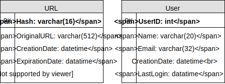

**What kind of database should we use?** Since we anticipate storing billions of rows, and we don’t need to use relationships between objects – a NoSQL store like [DynamoDB](https://en.wikipedia.org/wiki/Amazon_DynamoDB), [Cassandra](https://en.wikipedia.org/wiki/Apache_Cassandra) or [Riak](https://en.wikipedia.org/wiki/Riak) is a better choice. A NoSQL choice would also be easier to scale. Please see [SQL vs NoSQL](../basics/sql-vs-nosql.md) for more details.

## 6. Basic System Design and Algorithm
The problem we are solving here is, how to generate a short and unique key for a given URL.

In the TinyURL example in Section 1, the shortened URL is “[https://tinyurl.com/y7lpl6np](https://tinyurl.com/y7lpl6np)”. The last seven characters of this URL is the short key we want to generate. We’ll explore two solutions here:

### a. Encoding actual URL
We can compute a unique hash (e.g., [MD5](https://en.wikipedia.org/wiki/MD5) or [SHA256](https://en.wikipedia.org/wiki/SHA-2), etc.) of the given URL. The hash can then be encoded for displaying. This encoding could be base36 ([a-z ,0-9]) or base62 ([A-Z, a-z, 0-9]) and if we add ‘+’ and ‘/’ we can use [Base64](https://en.wikipedia.org/wiki/Base64#Base64_table) encoding. A reasonable question would be, what should be the length of the short key? 6, 8, or 10 characters?

* Using base64 encoding, a 6 letters long key would result in 64^6 = ~68.7 billion possible strings
* Using base64 encoding, an 8 letters long key would result in 64^8 = ~281 trillion possible strings

With 68.7B unique strings, let’s assume six letter keys would suffice for our system.

If we use the MD5 algorithm as our hash function, it’ll produce a 128-bit hash value. After base64 encoding, we’ll get a string having more than 21 characters (since each base64 character encodes 6 bits of the hash value). Now we only have space for 8 characters per short key, how will we choose our key then? We can take the first 6 (or 8) letters for the key. This could result in key duplication, to resolve that, we can choose some other characters out of the encoding string or swap some characters.

**What are the different issues with our solution?** We have the following couple of problems with our encoding scheme:

1. If multiple users enter the same URL, they can get the same shortened URL, which is not acceptable.
2. What if parts of the URL are URL-encoded? e.g., https://www.google.com/search?q=computer+science, and https://www.google.com/search%3Fq%3Dcomputer%2Bscience are identical except for the URL encoding.

**Workaround for the issues:** We can append an increasing sequence number to each input URL to make it unique, and then generate a hash of it. We don’t need to store this sequence number in the databases, though. Possible problems with this approach could be an ever-increasing sequence number. Can it overflow? Appending an increasing sequence number will also impact the performance of the service.

Another solution could be to append user id (which should be unique) to the input URL. However, if the user has not signed in, we would have to ask the user to choose a uniqueness key. Even after this, if we have a conflict, we have to keep generating a key until we get a unique one.

<details>
  <summary>Phase 1</summary>
    
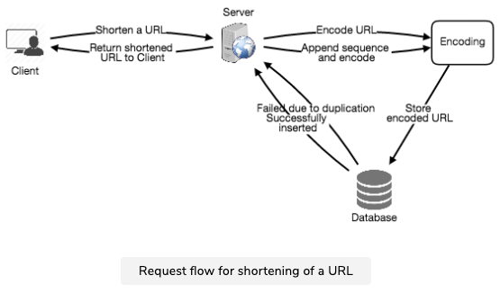

</details>
<details>
  <summary>Phase 2</summary>
    
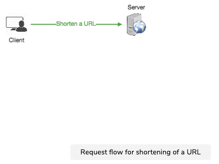

</details>
<details>
  <summary>Phase 3</summary>
    


</details>
<details>
  <summary>Phase 4</summary>
    
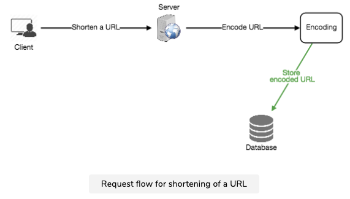
    
</details>
<details>
  <summary>Phase 5</summary>
    
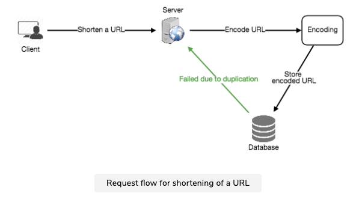
    
</details>
<details>
  <summary>Phase 6</summary>
    
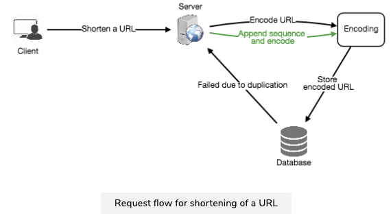
    
</details>
<details>
  <summary>Phase 7</summary>
    
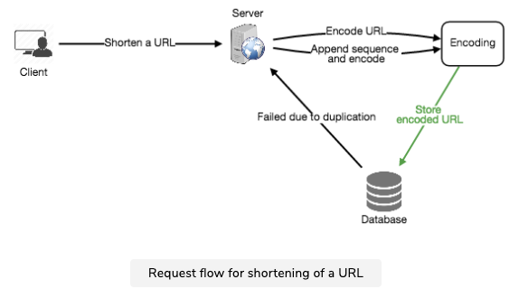
    
</details>
<details>
  <summary>Phase 8</summary>
    
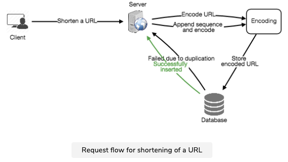
    
</details>
<details>
  <summary>Phase 9</summary>
    
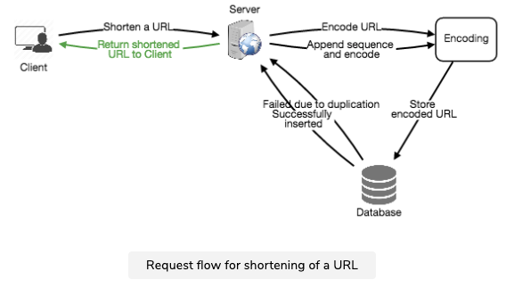
    
</details>

### b. Generating keys offline
We can have a standalone **Key Generation Service (KGS)** that generates random six-letter strings beforehand and stores them in a database (let’s call it key-DB). Whenever we want to shorten a URL, we will just take one of the already-generated keys and use it. This approach will make things quite simple and fast. Not only are we not encoding the URL, but we won’t have to worry about duplications or collisions. KGS will make sure all the keys inserted into key-DB are unique

**Can concurrency cause problems?** As soon as a key is used, it should be marked in the database to ensure it doesn’t get reuse. If there are multiple servers reading keys concurrently, we might get a scenario where two or more servers try to read the same key from the database. How can we solve this concurrency problem?

Servers can use KGS to read/mark keys in the database. KGS can use two tables to store keys: one for keys that are not used yet, and one for all the used keys. As soon as KGS gives keys to one of the servers, it can move them to the used keys table. KGS can always keep some keys in memory so that it can quickly provide them whenever a server needs them.

For simplicity, as soon as KGS loads some keys in memory, it can move them to the used keys table. This ensures each server gets unique keys. If KGS dies before assigning all the loaded keys to some server, we will be wasting those keys–which could be acceptable, given the huge number of keys we have.

KGS also has to make sure not to give the same key to multiple servers. For that, it must synchronize (or get a lock on) the data structure holding the keys before removing keys from it and giving them to a server.

**What would be the key-DB size?** With base64 encoding, we can generate 68.7B unique six letters keys. If we need one byte to store one alpha-numeric character, we can store all these keys in:

#### <div align="center">6 (characters per key) * 68.7B (unique keys) = 412 GB.</div>

**Isn’t KGS a single point of failure?** Yes, it is. To solve this, we can have a standby replica of KGS. Whenever the primary server dies, the standby server can take over to generate and provide keys.

**Can each app server cache some keys from key-DB?** Yes, this can surely speed things up. Although in this case, if the application server dies before consuming all the keys, we will end up losing those keys. This can be acceptable since we have 68B unique six-letter keys.

**How would we perform a key lookup?** We can look up the key in our database to get the full URL. If it’s present in the DB, issue an “HTTP 302 Redirect” status back to the browser, passing the stored URL in the “Location” field of the request. If that key is not present in our system, issue an “HTTP 404 Not Found” status or redirect the user back to the homepage.

**Should we impose size limits on custom aliases?** Our service supports custom aliases. Users can pick any ‘key’ they like, but providing a custom alias is not mandatory. However, it is reasonable (and often desirable) to impose a size limit on a custom alias to ensure we have a consistent URL database. Let’s assume users can specify a maximum of 16 characters per customer key (as reflected in the above database schema).


## 7. Data Partitioning and Replication
To scale out our DB, we need to partition it so that it can store information about billions of URLs. We need to come up with a partitioning scheme that would divide and store our data into different DB servers.

**a. Range Based Partitioning**: We can store URLs in separate partitions based on the first letter of the hash key. Hence we save all the URLs starting with letter ‘A’ (and ‘a’) in one partition, save those that start with letter ‘B’ in another partition and so on. This approach is called range-based partitioning. We can even combine certain less frequently occurring letters into one database partition. We should come up with a static partitioning scheme so that we can always store/find a URL in a predictable manner.

The main problem with this approach is that it can lead to unbalanced DB servers. For example, we decide to put all URLs starting with letter ‘E’ into a DB partition, but later we realize that we have too many URLs that start with the letter ‘E’.

**b. Hash-Based Partitioning**: In this scheme, we take a hash of the object we are storing. We then calculate which partition to use based upon the hash. In our case, we can take the hash of the ‘key’ or the short link to determine the partition in which we store the data object.

Our hashing function will randomly distribute URLs into different partitions (e.g., our hashing function can always map any ‘key’ to a number between [1…256]), and this number would represent the partition in which we store our object.

This approach can still lead to overloaded partitions, which can be solved by using [Consistent Hashing](../basics/consistent-hashing.md).

## 8. Cache
We can cache URLs that are frequently accessed. We can use some off-the-shelf solution like [Memcached](https://en.wikipedia.org/wiki/Memcached), which can store full URLs with their respective hashes. The application servers, before hitting backend storage, can quickly check if the cache has the desired URL.

**How much cache memory should we have?** We can start with 20% of daily traffic and, based on clients’ usage pattern, we can adjust how many cache servers we need. As estimated above, we need 170GB memory to cache 20% of daily traffic. Since a modern-day server can have 256GB memory, we can easily fit all the cache into one machine. Alternatively, we can use a couple of smaller servers to store all these hot URLs.

**Which cache eviction policy would best fit our needs?** When the cache is full, and we want to replace a link with a newer/hotter URL, how would we choose? Least Recently Used (LRU) can be a reasonable policy for our system. Under this policy, we discard the least recently used URL first. We can use a [Linked Hash Map](https://docs.oracle.com/javase/7/docs/api/java/util/LinkedHashMap.html) or a similar data structure to store our URLs and Hashes, which will also keep track of the URLs that have been accessed recently.

To further increase the efficiency, we can replicate our caching servers to distribute the load between them.

**How can each cache replica be updated?** Whenever there is a cache miss, our servers would be hitting a backend database. Whenever this happens, we can update the cache and pass the new entry to all the cache replicas. Each replica can update its cache by adding the new entry. If a replica already has that entry, it can simply ignore it.


<details>
  <summary>Phase 1</summary>
    
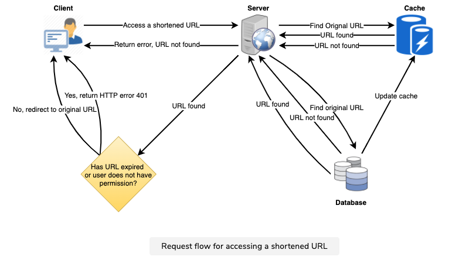

</details>
<details>
  <summary>Phase 2</summary>
    
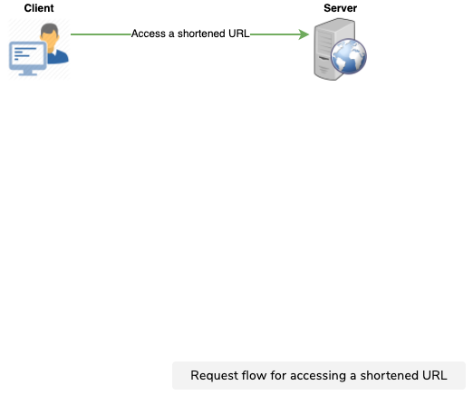

</details>
<details>
  <summary>Phase 3</summary>
    
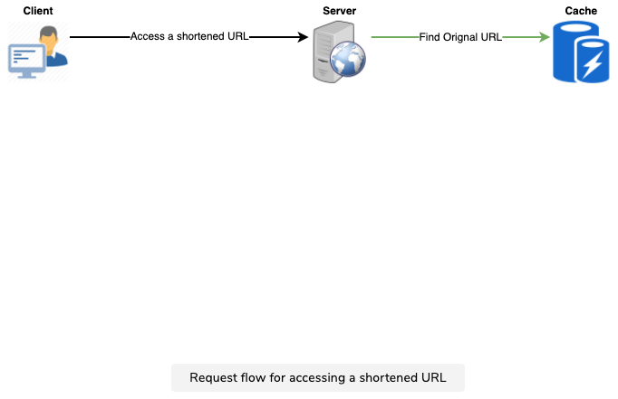

</details>
<details>
  <summary>Phase 4</summary>
    

    
</details>
<details>
  <summary>Phase 5</summary>
    
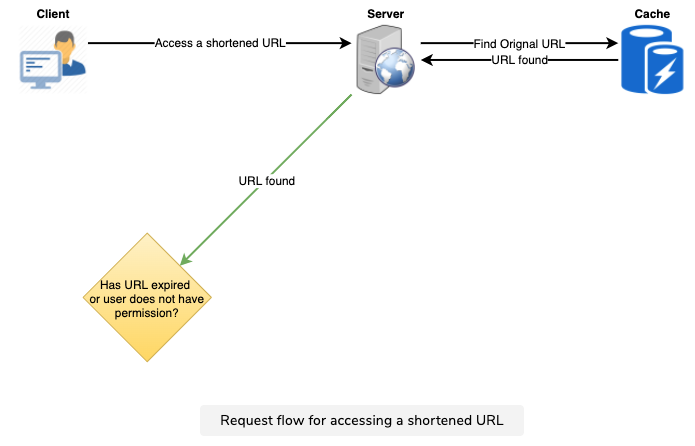
    
</details>
<details>
  <summary>Phase 6</summary>
    
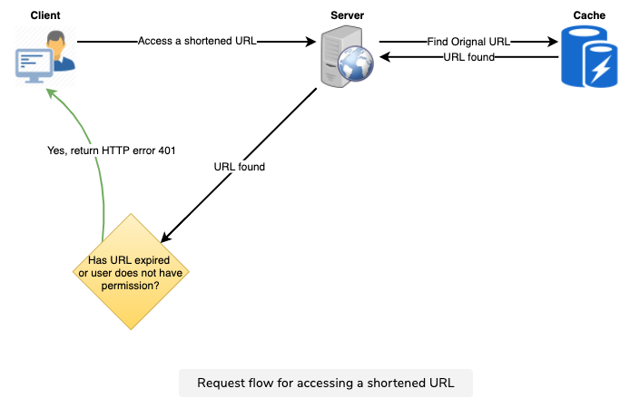
    
</details>
<details>
  <summary>Phase 7</summary>
    
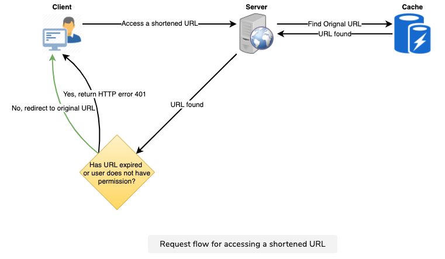
    
</details>
<details>
  <summary>Phase 8</summary>
    
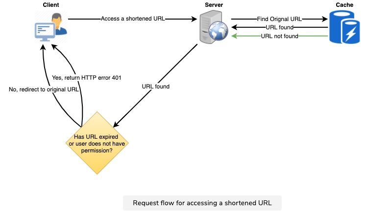
    
</details>
<details>
  <summary>Phase 9</summary>
    
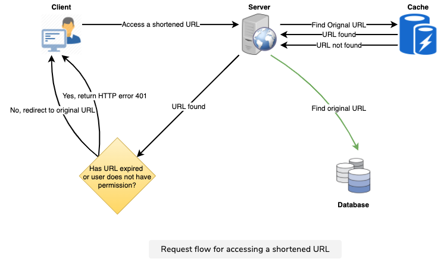
    
</details>
<details>
  <summary>Phase 10</summary>
    
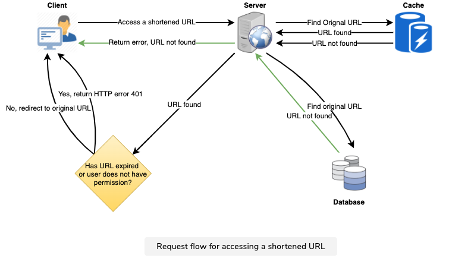
    
</details>
<details>
  <summary>Phase 11</summary>
    
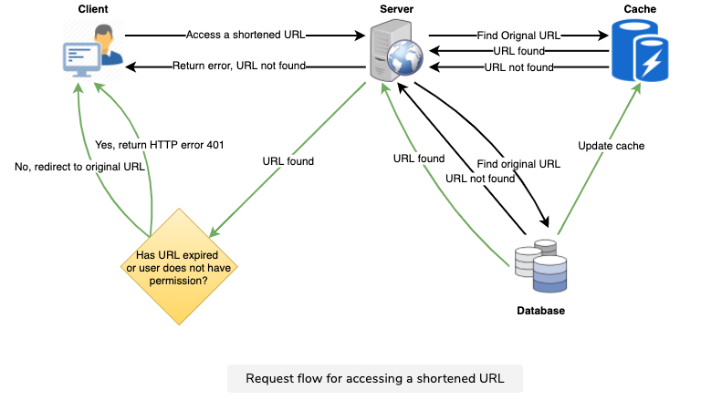
    
</details>

## 9. Load Balancer (LB)
We can add a Load balancing layer at three places in our system:

1. Between Clients and Application servers
2. Between Application Servers and database servers
3. Between Application Servers and Cache servers

Initially, we could use a simple Round Robin approach that distributes incoming requests equally among backend servers. This LB is simple to implement and does not introduce any overhead. Another benefit of this approach is that if a server is dead, LB will take it out of the rotation and will stop sending any traffic to it.

A problem with Round Robin LB is that we don’t take the server load into consideration. If a server is overloaded or slow, the LB will not stop sending new requests to that server. To handle this, a more intelligent LB solution can be placed that periodically queries the backend server about its load and adjusts traffic based on that.

## 10. Purging or DB cleanup
Should entries stick around forever or should they be purged? If a user-specified expiration time is reached, what should happen to the link?

If we chose to actively search for expired links to remove them, it would put a lot of pressure on our database. Instead, we can slowly remove expired links and do a lazy cleanup. Our service will make sure that only expired links will be deleted, although some expired links can live longer but will never be returned to users.

Whenever a user tries to access an expired link, we can delete the link and return an error to the user.
A separate Cleanup service can run periodically to remove expired links from our storage and cache. This service should be very lightweight and can be scheduled to run only when the user traffic is expected to be low.
We can have a default expiration time for each link (e.g., two years).
After removing an expired link, we can put the key back in the key-DB to be reused.
Should we remove links that haven’t been visited in some length of time, say six months? This could be tricky. Since storage is getting cheap, we can decide to keep links forever.


## 11. Telemetry
How many times a short URL has been used, what were user locations, etc.? How would we store these statistics? If it is part of a DB row that gets updated on each view, what will happen when a popular URL is slammed with a large number of concurrent requests?

Some statistics worth tracking: country of the visitor, date and time of access, web page that refers the click, browser, or platform from where the page was accessed.

## 12. Security and Permissions
Can users create private URLs or allow a particular set of users to access a URL?

We can store the permission level (public/private) with each URL in the database. We can also create a separate table to store UserIDs that have permission to see a specific URL. If a user does not have permission and tries to access a URL, we can send an error (HTTP 401) back. Given that we are storing our data in a NoSQL wide-column database like Cassandra, the key for the table storing permissions would be the ‘Hash’ (or the KGS generated ‘key’). The columns will store the UserIDs of those users that have the permission to see the URL.
