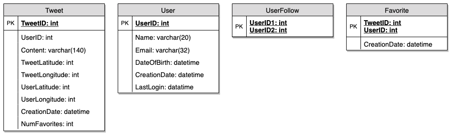

# Twitter
Let's design a Twitter-like social networking service. Users of the service will be able to post tweets, follow other people, and favorite tweets.

Difficulty Level: Medium

## 1. What is Twitter?
Twitter is an online social networking service where users post and read short 140-character messages called "tweets." Registered users can post and read tweets, but those who are not registered can only read them. Users access Twitter through their website interface, SMS, or mobile app.

## 2. Requirements and Goals of the System
We will be designing a simpler version of Twitter with the following requirements:

### Functional Requirements
1. Users should be able to post new tweets.
2. A user should be able to follow other users.
3. Users should be able to mark tweets as favorites.
4. The service should be able to create and display a user’s timeline consisting of top tweets from all the people the user follows.
5. Tweets can contain photos and videos.

### Non-functional Requirements
1. Our service needs to be highly available.
2. Acceptable latency of the system is 200ms for timeline generation.
3. Consistency can take a hit (in the interest of availability); if a user doesn’t see a tweet for a while, it should be fine.

### Extended Requirements
1. Searching for tweets.
2. Replying to a tweet.
3. Trending topics – current hot topics/searches.
4. Tagging other users.
5. Tweet Notification.
6. Who to follow? Suggestions?
7. Moments.

## 3. Capacity Estimation and Constraints
Let’s assume we have one billion total users with 200 million daily active users (DAU). Also assume we have 100 million new tweets every day and on average each user follows 200 people.

**How many favorites per day?** If, on average, each user favorites five tweets per day we will have:

#### 
200M users * 5 favorites => 1B favorites

**How many total tweet-views will our system generate?** Let’s assume on average a user visits their timeline two times a day and visits five other people’s pages. On each page if a user sees 20 tweets, then our system will generate 28B/day total tweet-views:

#### 
200M DAU * ((2 + 5) * 20 tweets) => 28B/day

  
**Storage Estimates**: Let’s say each tweet has 140 characters and we need two bytes to store a character without compression. Let’s assume we need 30 bytes to store metadata with each tweet (like ID, timestamp, user ID, etc.). Total storage we would need:

#### 
100M * (280 + 30) bytes => 30GB/day

  
What would our storage needs be for five years? How much storage we would need for users’ data, follows, favorites? We will leave this for the exercise.

Not all tweets will have media, let’s assume that on average every fifth tweet has a photo and every tenth has a video. Let’s also assume on average a photo is 200KB and a video is 2MB. This will lead us to have 24TB of new media every day.

#### 
(100M/5 photos * 200KB) + (100M/10 videos * 2MB) ~= 24TB/day

  
**Bandwidth Estimates**: Since total ingress is 24TB per day, this would translate into 290MB/sec.

Remember that we have 28B tweet views per day. We must show the photo of every tweet (if it has a photo), but let’s assume that the users watch every 3rd video they see in their timeline. So, total egress will be:

#### 
(28B * 280 bytes) / 86400s of text => 93MB/day

#### 
+ (28B/5 * 200KB ) / 86400s of photos => 13GB/day

#### 
+ (28B/10/3 * 2MB ) / 86400s of Videos => 22GB/day

#### 
Total ~= 35GB/day

## 4. System APIs
### 💡 Once we've finalized the requirements, it's always a good idea to define the system APIs. This should explicitly state what is expected from the system.

We can have SOAP or REST APIs to expose the functionality of our service. Following could be the definition of the API for posting a new tweet:

#### 
tweet(api_dev_key, tweet_data, tweet_location, user_location, media_ids)

**Parameters:**

* api_dev_key (string): The API developer key of a registered account. This will be used to, among other things, throttle users based on their allocated quota.
* tweet_data (string): The text of the tweet, typically up to 140 characters.
* tweet_location (string): Optional location (longitude, latitude) this Tweet refers to.
* user_location (string): Optional location (longitude, latitude) of the user adding the tweet.
* media_ids (number[]): Optional list of media_ids to be associated with the Tweet. (all the media photo, video, etc. need to be uploaded separately).

**Returns**: (string)

A successful post will return the URL to access that tweet. Otherwise, an appropriate HTTP error is returned.

## 5. High Level System Design
We need a system that can efficiently store all the new tweets, 100M/86400s => 1150 tweets per second and read 28B/86400s => 325K tweets per second. It is clear from the requirements that this will be a read-heavy system.

At a high level, we need multiple application servers to serve all these requests with load balancers in front of them for traffic distributions. On the backend, we need an efficient database that can store all the new tweets and can support a huge number of reads. We also need some file storage to store photos and videos.

Although our expected daily write load is 100 million and read load is 28 billion tweets. This means on average our system will receive around 1160 new tweets and 325K read requests per second. This traffic will be distributed unevenly throughout the day, though, at peak time we should expect at least a few thousand write requests and around 1M read requests per second. We should keep this in mind while designing the architecture of our system.

## 6. Database Schema
We need to store data about users, their tweets, their favorite tweets, and people they follow.

For choosing between SQL and NoSQL databases to store the above schema, please see ‘Database schema’ under [Designing Instagram](./instagram.md).

##  7. Data Sharding
Since we have a huge number of new tweets every day and our read load is extremely high too, we need to distribute our data onto multiple machines such that we can read/write it efficiently. We have many options to shard our data; let’s go through them one by one:

**Sharding based on UserID**: We can try storing all the data of a user on one server. While storing, we can pass the UserID to our hash function that will map the user to a database server where we will store all of the user’s tweets, favorites, follows, etc. While querying for tweets/follows/favorites of a user, we can ask our hash function where can we find the data of a user and then read it from there. This approach has a couple of issues:

1. What if a user becomes hot? There could be a lot of queries on the server holding the user. This high load will affect the performance of our service.
2. Over time some users can end up storing a lot of tweets or having a lot of follows compared to others. Maintaining a uniform distribution of growing user data is quite difficult.

To recover from these situations either we have to repartition/redistribute our data or use consistent hashing.

**Sharding based on TweetID**: Our hash function will map each TweetID to a random server where we will store that Tweet. To search for tweets, we have to query all servers, and each server will return a set of tweets. A centralized server will aggregate these results to return them to the user. Let’s look into timeline generation example; here are the number of steps our system has to perform to generate a user’s timeline:

1. Our application (app) server will find all the people the user follows.
2. App server will send the query to all database servers to find tweets from these people.
3. Each database server will find the tweets for each user, sort them by recency and return the top tweets.
4. App server will merge all the results and sort them again to return the top results to the user.

This approach solves the problem of hot users, but, in contrast to sharding by UserID, we have to query all database partitions to find tweets of a user, which can result in higher latencies.

We can further improve our performance by introducing cache to store hot tweets in front of the database servers.

**Sharding based on Tweet creation time**: Storing tweets based on creation time will give us the advantage of fetching all the top tweets quickly and we only have to query a very small set of servers. The problem here is that the traffic load will not be distributed, e.g., while writing, all new tweets will be going to one server and the remaining servers will be sitting idle. Similarly, while reading, the server holding the latest data will have a very high load as compared to servers holding old data.

**What if we can combine sharding by TweetID and Tweet creation time?** If we don’t store tweet creation time separately and use TweetID to reflect that, we can get benefits of both the approaches. This way it will be quite quick to find the latest Tweets. For this, we must make each TweetID universally unique in our system and each TweetID should contain a timestamp too.

We can use epoch time for this. Let’s say our TweetID will have two parts: the first part will be representing epoch seconds and the second part will be an auto-incrementing sequence. So, to make a new TweetID, we can take the current epoch time and append an auto-incrementing number to it. We can figure out the shard number from this TweetID and store it there.

What could be the size of our TweetID? Let’s say our epoch time starts today, how many bits we would need to store the number of seconds for the next 50 years?

#### 
86400 sec/day * 365 (days a year) * 50 (years) => 1.6B

We would need 31 bits to store this number. Since on average we are expecting 1150 new tweets per second, we can allocate 17 bits to store auto incremented sequence; this will make our TweetID 48 bits long. So, every second we can store (2^17 => 130K) new tweets. We can reset our auto incrementing sequence every second. For fault tolerance and better performance, we can have two database servers to generate auto-incrementing keys for us, one generating even numbered keys and the other generating odd numbered keys.

If we assume our current epoch seconds are “1483228800,” our TweetID will look like this:

#### 
1483228800 000001

#### 
1483228800 000002

#### 
1483228800 000003

#### 
1483228800 000004

#### 
…

If we make our TweetID 64bits (8 bytes) long, we can easily store tweets for the next 100 years and also store them for mili-seconds granularity.

In the above approach, we still have to query all the servers for timeline generation, but our reads (and writes) will be substantially quicker.

1. Since we don’t have any secondary index (on creation time) this will reduce our write latency.
2. While reading, we don’t need to filter on creation-time as our primary key has epoch time included in it.

## 8. Cache
We can introduce a cache for database servers to cache hot tweets and users. We can use an off-the-shelf solution like Memcache that can store the whole tweet objects. Application servers, before hitting database, can quickly check if the cache has desired tweets. Based on clients’ usage patterns we can determine how many cache servers we need.

**Which cache replacement policy would best fit our needs?** When the cache is full and we want to replace a tweet with a newer/hotter tweet, how would we choose? Least Recently Used (LRU) can be a reasonable policy for our system. Under this policy, we discard the least recently viewed tweet first.

**How can we have a more intelligent cache?** If we go with 80-20 rule, that is 20% of tweets generating 80% of read traffic which means that certain tweets are so popular that a majority of people read them. This dictates that we can try to cache 20% of daily read volume from each shard.

**What if we cache the latest data?** Our service can benefit from this approach. Let’s say if 80% of our users see tweets from the past three days only; we can try to cache all the tweets from the past three days. Let’s say we have dedicated cache servers that cache all the tweets from all the users from the past three days. As estimated above, we are getting 100 million new tweets or 30GB of new data every day (without photos and videos). If we want to store all the tweets from last three days, we will need less than 100GB of memory. This data can easily fit into one server, but we should replicate it onto multiple servers to distribute all the read traffic to reduce the load on cache servers. So whenever we are generating a user’s timeline, we can ask the cache servers if they have all the recent tweets for that user. If yes, we can simply return all the data from the cache. If we don’t have enough tweets in the cache, we have to query the backend server to fetch that data. On a similar design, we can try caching photos and videos from the last three days.

Our cache would be like a hash table where ‘key’ would be ‘OwnerID’ and ‘value’ would be a doubly linked list containing all the tweets from that user in the past three days. Since we want to retrieve the most recent data first, we can always insert new tweets at the head of the linked list, which means all the older tweets will be near the tail of the linked list. Therefore, we can remove tweets from the tail to make space for newer tweets.

## 9. Timeline Generation
For a detailed discussion about timeline generation, take a look at [Designing Facebook’s Newsfeed](facebook-newsfeed.md).

## 10. Replication and Fault Tolerance
Since our system is read-heavy, we can have multiple secondary database servers for each DB partition. Secondary servers will be used for read traffic only. All writes will first go to the primary server and then will be replicated to secondary servers. This scheme will also give us fault tolerance, since whenever the primary server goes down we can failover to a secondary server.

## 11. Load Balancing
We can add Load balancing layer at three places in our system 

1. Between Clients and Application servers
2. Between Application servers and database replication servers and
3. Between Aggregation servers and Cache server. 

Initially, a simple Round Robin approach can be adopted; that distributes incoming requests equally among servers. This LB is simple to implement and does not introduce any overhead. Another benefit of this approach is that if a server is dead, LB will take it out of the rotation and will stop sending any traffic to it. A problem with Round Robin LB is that it won’t take servers load into consideration. If a server is overloaded or slow, the LB will not stop sending new requests to that server. To handle this, a more intelligent LB solution can be placed that periodically queries backend server about their load and adjusts traffic based on that.

## 12. Monitoring
Having the ability to monitor our systems is crucial. We should constantly collect data to get an instant insight into how our system is doing. We can collect following metrics/counters to get an understanding of the performance of our service:

1. New tweets per day/second, what is the daily peak?
2. Timeline delivery stats, how many tweets per day/second our service is delivering.
3. Average latency that is seen by the user to refresh timeline.

By monitoring these counters, we will realize if we need more replication, load balancing, or caching.

## 13. Extended Requirements
**How do we serve feeds?** Get all the latest tweets from the people someone follows and merge/sort them by time. Use pagination to fetch/show tweets. Only fetch top N tweets from all the people someone follows. This N will depend on the client’s Viewport, since on a mobile we show fewer tweets compared to a Web client. We can also cache next top tweets to speed things up.

Alternately, we can pre-generate the feed to improve efficiency; for details please see ‘Ranking and timeline generation’ under [Designing Instagram](instagram.md).

**Retweet**: With each Tweet object in the database, we can store the ID of the original Tweet and not store any contents on this retweet object.

**Trending Topics**: We can cache most frequently occurring hashtags or search queries in the last N seconds and keep updating them after every M seconds. We can rank trending topics based on the frequency of tweets or search queries or retweets or likes. We can give more weight to topics which are shown to more people.

**Who to follow? How to give suggestions?** This feature will improve user engagement. We can suggest friends of people someone follows. We can go two or three levels down to find famous people for the suggestions. We can give preference to people with more followers.

As only a few suggestions can be made at any time, use Machine Learning (ML) to shuffle and re-prioritize. ML signals could include people with recently increased follow-ship, common followers if the other person is following this user, common location or interests, etc.

**Moments**: Get top news for different websites for past 1 or 2 hours, figure out related tweets, prioritize them, categorize them (news, support, financial, entertainment, etc.) using ML – supervised learning or Clustering. Then we can show these articles as trending topics in Moments.

**Search**: Search involves Indexing, Ranking, and Retrieval of tweets. A similar solution is discussed in our next problem [Design Twitter Search](twitter-search.md).
